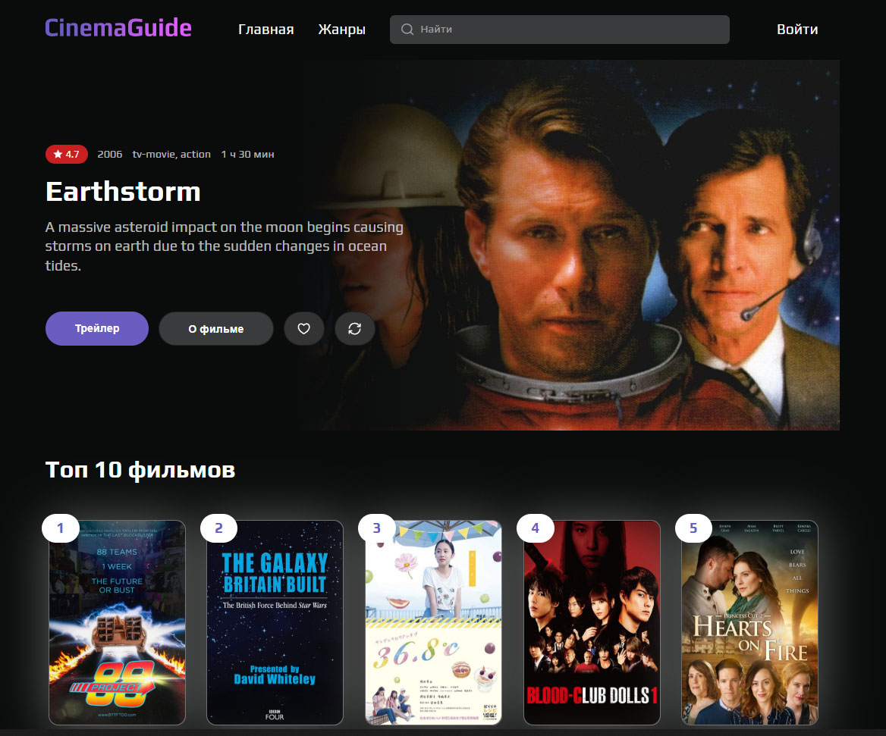

# Описание проекта


Cinema Guide — это веб-приложение, предоставляющее информацию о фильмах, их рейтингах и других деталях.

Cinema Guide позволяет пользователям:

Смотреть описание фильмов, их рейтинг, жанр, актеров, трейлер и страну производства.

Видеть на главной странице случайный фильм и топ-10 фильмов с самым высоким рейтингом.

Авторизоваться или зарегистрироваться для добавления фильмов в избранное.


## Запуск проекта

`1.` Установка зависимостей

```bash
npm install
```

`2.` Запуск проекта в режиме разработки

```bash
npm start
```

Проект будет запущен на http://localhost:3000/.

`3.` Сборка проекта для продакшена

```bash
npm run build
```

Собранный проект будет находиться в папке build/.

## Стек технологий

`1.` React — библиотека для создания пользовательских интерфейсов.

`2.` Redux Toolkit — управление состоянием приложения.

`3.` React Router — маршрутизация в приложении.

`4.` Axios — работа с HTTP-запросами.

`5.` Formik + Yup — управление формами и валидация.

`6.` Sass — стилизация приложения.

`7.` TypeScript — статическая типизация.